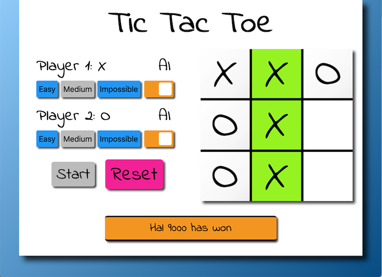
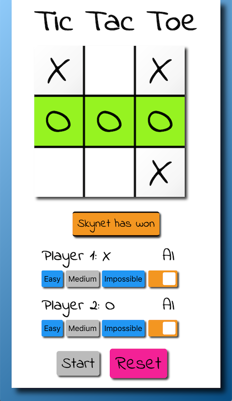

# Project: Tic-Tac-Toe

This is a fantastic remake of the classic Tic-Tac-Toe game.
This game is a little different from the others.
Not only can you play against a 2nd human player, you can pit the 2 AI's against themselves.
Just sit back, relax and watch the two AI's duke it out.
If both AI's are placed in "Impossible" difficulty, they will always end up in a tie.

## [Play Online](https://winplam.github.io/tic-tac-toe/)

## The Algorithm
One easy mode, the AI is simply picking moves at random. Should be a cinch to beat.
At the other end of the spectrum is the impossible mode.
On this mode, it uses a [Minimax algorithm](https://en.wikipedia.org/wiki/Minimax).
Essentially the AI recursively picks every possible move and checks to see if the move is a winner.
It tallies up a score to come up with the best move and chooses the first one in case of a tie.
To make the medium difficulty, the computer simply alternates between the easy and impossible algorithm in between each move.

## Desktop Screenshot

## Mobile Screenshot

## The Design
There are many ways to make a 3x3 grid.
I chose to use a Grid Box layout and instead of using partial borders for the dividing lines,
the lines is actually a black background showing through margin gaps.
CSS media queries to rearrange the Display Grid items from horizontal to vertical. 
